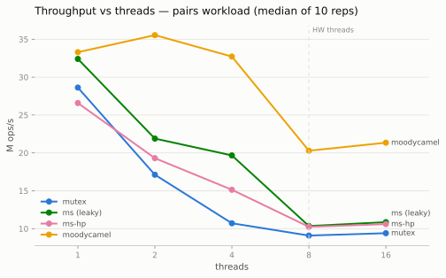
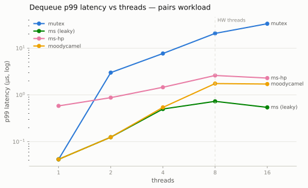

# A lock-free MPMC queue, and the harder problem underneath it

A Michael–Scott lock-free multi-producer/multi-consumer queue in C++20,
with hazard-pointer safe memory reclamation, a layered verification
suite, and a benchmark harness built before the queue was.

> A lock-free queue is easy to write and hard to make correct — the
> difficulty is not the algorithm, it's knowing when it is safe to free
> memory.

That sentence is the project. The algorithm section of Michael & Scott's
paper fits on one page; everything that makes this repository more than
a tutorial transcription — the reclamation scheme, the verification
layers, the measurement methodology — exists because of what happens
*after* a node is unlinked.

**The headline numbers** (Apple M2, 16 threads = 2× hardware
concurrency, details and caveats below):

| | dequeue p99 | throughput |
|---|---|---|
| `std::mutex` + `std::queue` | 31.8 µs | 9.4M ops/s, degrading |
| this queue + hazard pointers | **2.3 µs** | 10.6M ops/s, flat |

A preempted lock holder stalls every waiter for a scheduling quantum; a
preempted CAS loser stalls nobody. Oversubscription is where that
distinction becomes a 14× tail-latency gap — and it is the regime the
mutex-vs-lock-free decision is actually about.

**Non-goals, stated up front:** this does not try to beat production
queues (it is benchmarked against one that beats it, with a diagnosis of
why); it is not a general-purpose library; and it is tested and
model-argued, not formally verified.

---

## Architecture

```
include/lfq/
  ms_queue.hpp        Michael–Scott queue: ms_queue<T, Reclaimer, PadHeadTail>
  hazard_pointer.hpp  hp_domain + hp_reclaimer (safe memory reclamation)
  mutex_queue.hpp     std::mutex + std::queue — the control group
  padding.hpp         cache-line constant (128B on Apple Silicon, 64B x86)
  inject.hpp          adversarial-scheduling injection points (test builds)
tests/                unit, stress, reclaim + adversarial_* variants
bench/                harness.hpp, bench_main.cpp (4 workloads), plot.py
results/              machine record, CSVs, charts, analysis notes
third_party/          moodycamel::ConcurrentQueue (vendored, bench-only)
```

Two structural choices carry the project:

- **Reclamation is a template parameter**, not a baked-in policy.
  `ms_queue<T, leaky_reclaimer>` (never frees) and
  `ms_queue<T, hp_reclaimer>` are the same algorithm, so the cost of
  memory safety is a measurable delta, not a guess. The seam is shaped
  for hazard pointers — `guard.protect(slot, src)` re-verifies its
  source; `guard.set(slot, p)` publishes and lets the caller re-validate
  — which is what let phase 2 drop in without touching the algorithm.
- **The queue is header-only and the padding is a flag.**
  `PadHeadTail=false` places `head_` and `tail_` on one cache line, so
  the false-sharing claim is an experiment (§ results), not folklore.

## The algorithm, and what makes it lock-free

Singly-linked list, permanent dummy node, `head_` and `tail_` never
null. Enqueue links at the tail with a CAS on `tail->next` (the
linearization point), then swings `tail_`. Dequeue reads the value out
of `head->next`, CASes `head_` forward, and retires the old dummy.

The part worth internalizing is **helping**: if an enqueuer is suspended
between linking its node and swinging `tail_`, every other thread
recognizes the lagging tail and completes the swing before proceeding.
No thread can block the system by stopping at the wrong moment — that is
the lock-freedom guarantee, and it is a *system-wide* progress property,
not a per-thread one. This queue is lock-free, not wait-free: an
individual thread can lose its CAS forever while others win. (The
distinction is not pedantry; it decides what tail-latency promises you
can make.)

Second load-bearing detail: dequeue reads the value **before** its CAS.
After the CAS, `next` is the new dummy and may be dequeued and retired
by another thread — reading after is a use-after-free the moment
reclamation is real. Write the read on the wrong side and every test
passes until phase 2, which is exactly why the leaky phase existed.

## Memory ordering

The discipline, in order: make everything `seq_cst`; build the
verification net (TSan + adversarial scheduling, running on a
weakly-ordered AArch64 machine where ordering bugs can actually fire);
*then* relax one class of operation at a time, re-running every suite
and measuring after each step. The full table with per-site invariants
is in [DESIGN.md](DESIGN.md); the shape of it:

| Operation | Ordering | Why |
|---|---|---|
| loads of `head_`/`tail_`/`next` | `acquire` | must see contents the linking CAS released; dequeue's `tail_` load anchors the `head≠tail ⇒ next≠null` chain |
| link CAS, tail/head swings | `release` (success) / `relaxed` (failure) | publication points; failure values are discarded |
| hazard publish store + verify load | **`seq_cst`, cannot relax** | a store→load pair — the one shape release/acquire cannot order |
| scan-side | one `seq_cst` fence per scan | the mirror half of the protocol, amortized over the whole snapshot |
| accounting counters | `relaxed` | monitoring, never proof |

**What relaxing bought: nothing measurable on this machine — reported
as a finding, not buried.** On AArch64, `seq_cst` loads and stores
compile to `ldar`/`stlr`, the same instructions acquire/release
produce; the hot costs are CAS retries and cache-line traffic. The
ordering work earns its keep as documented invariants (and on x86,
where a `seq_cst` store is a real barrier, the one store that matters —
the hazard publish — is precisely the one that *cannot* be relaxed;
that barrier is the honest per-access price of hazard pointers on TSO).

## Reclamation: the actual hard part

Unlink a node and free it, and a thread that loaded the pointer just
before the unlink dereferences freed memory. Worse than the crash you
might get: the allocator recycles the address, a new node lands there,
and a stale CAS *succeeds* on the wrong node. That is ABA — silent
corruption. Tagged pointers defeat the ABA symptom but the read through
the freed pointer already happened; the only real fix is knowing when no
thread can still be reading a retired node.

**Hazard pointers (Michael, 2004), chosen over epoch-based reclamation
as a decision with a loser:** EBR's read path is nearly free, but one
stalled thread pins *every* retired node in the system — unbounded
garbage with a graceless failure mode. Hazard pointers pay a per-access
publish (with the `seq_cst` ordering above) and get in exchange a
**bounded** garbage guarantee: at most `O(records × K + threshold)`
nodes can be unreclaimed, no matter which thread stalls where.

That bound is the property worth defending, so it is *asserted while
the system is hot* — `reclaim_test` samples in-flight garbage during a
concurrent run and fails if it exceeds the bound (a leaky reclaimer
fails it by ~three orders of magnitude, which is the control proving
the assertion has teeth). The rest of the contract is enforced by
accounting (`retired == freed` after a quiesced drain) and by LSan in
CI. Thread exit hands still-protected nodes to an orphan stack that any
later scan adopts; nothing is silently dropped.

Measured price of safety: **−18% throughput single-threaded, −4% at 16
threads** (26.6 vs 32.4M, 10.6 vs 11.1M) — the publish cost hides under
CAS contention as threads grow — plus ~4× dequeue p99 vs leaky (2.3µs
vs 0.5µs at 16 threads: dequeue publishes two hazards).

## Correctness: layered, with named limits

Detailed in [DESIGN.md](DESIGN.md#verification). The layers, and what
each one cannot do:

1. **Sanitizers in CI since phase 0** — TSan (real races, understands
   atomics), ASan (use-after-free becomes a loud crash — `reclaim_test`
   deliberately dereferences a retired-but-protected node so a
   reclamation bug fires here), LSan (nothing leaks — the deliberately
   leaky baseline is explicitly bracketed), UBSan. TSan observes only
   schedules that ran; it proves presence of races, never absence.
2. **Structural invariants under stress** — no loss, no duplication
   (per-value counters), per-producer FIFO (the meaningful MPMC order
   assertion — global FIFO isn't one), drain-to-empty, plus the
   reclamation books above.
3. **Adversarial scheduling** — every known race window (`inject.hpp`)
   gets a random yield/spin injected, at 4× oversubscription, in the
   same test sources, under all sanitizers. This layer caught a real
   bug the plain suites missed (a cross-counter read-skew underflow in
   the garbage accounting).
4. **Two memory models on every push** — AArch64 locally (weakly
   ordered; the *stronger* testbed, where ordering mistakes actually
   fire) and x86-64 TSO in CI on GCC and Clang.

**Not done, named rather than hidden:** exhaustive interleaving
exploration (Relacy/CDSChecker — the deliberate first cut on the
de-scope list, and the highest-value next step); formal proof;
tool-checking of quiesced-only contracts (`empty()`, destruction).

## Results

Machine: Apple M2 (4P+4E, 128-byte cache lines), macOS, Apple clang,
`-O2`. **Caveats recorded before any numbers existed** in
[results/machine.md](results/machine.md): no thread pinning exists on
this OS (every CSV row records `pinned=0`), cores are heterogeneous,
DVFS is uncontrolled. Medians of 10 reps, 2 warmups discarded, IQR
kept; latency vectors preallocated; dequeue latency includes
empty-retry spinning, because "time until I hold an item" is what a
consumer experiences. Full analysis: [results/phase3b_notes.md](results/phase3b_notes.md)
(seq_cst era) and the `final_*` CSVs (shipped orderings).





**Throughput, pairs workload (M ops/s, median):**

| threads | mutex | ms (leaky) | ms-hp | moodycamel |
|---|---|---|---|---|
| 1 | 28.9 | 32.4 | 26.6 | 33.4 |
| 8 | 9.1 | 10.4 | 10.3 | 20.4 |
| 16 | 9.5 | 11.1 | 10.6 | 21.4 |

**Nobody scales on this workload — correctly.** Pairs keeps the queue
near-empty, so every thread contends on one or two cache lines; it is a
contention stress, not a parallelism showcase, and *negative* scaling
is the honest expectation for every design tested, including the
production one.

**The mutex wins at 1–2 threads.** 28.9 vs 26.6 single-threaded;
crossover at 4 threads. An uncontended mutex is cheap, and below the
crossover this queue's complexity buys nothing. Lock-free earns its
keep in the tail: by 8 threads the mutex p99 is 20.7µs against 2.6µs,
and under oversubscription 31.8µs against 2.3µs — while its throughput
degrades and the lock-free queues hold flat.

**False sharing, measured** ([chart](results/final_false_sharing.svg)):
`head_` and `tail_` on one 128-byte line costs **−25% (ms and ms-hp
alike) at 8 threads** (−21%/−34% at 16) versus line-separated —
every enqueue invalidates every dequeuer's line despite the fields
being logically independent. The inversion is part of the result:
single-threaded, adjacent is ~*faster* (one hot line beats two), so the
padding is a bet on contention, not a free win.

**Ratios** ([chart](results/final_ratio_bars.svg), 8 threads):
consumer-heavy 1:3 is the hard case — six consumers hammer a mostly
empty queue, and the mutex collapses to 2.7M ops/s because *failed*
dequeues still serialize through the lock, throttling the producers.
The MS queue's empty check is a read-mostly path: 7.1M, 2.6× the mutex.
Producer-heavy 3:1 exercises the helping path; everything improves.

**The honest comparison.** `moodycamel::ConcurrentQueue` wins
everywhere: ~2× on pairs at ≥8 threads, and **13×** on enqueue-only
(52.9 vs 4.2M ops/s at 8 threads). The enqueue number is the
diagnosis: moodycamel gives each producer its own block-based
sub-queue — enqueues never contend and amortize allocation over
blocks, while the MS queue pays one shared-tail CAS plus one `new` per
element. Dequeue-only shrinks the gap to 1.5× (consumers must visit
shared state either way). Two caveats travel with those numbers:
moodycamel's FIFO is per-producer only (weaker than this queue's
contract — part of what the speed buys), and its low-thread dequeue
p99 is worse than the MS queue's (its consumers search sub-queues).
Being beaten by a production design and knowing exactly why is the
result; a benchmark where the textbook queue won would be describing a
rigged workload.

## How the project was built (phases)

Each phase is a commit (or small series); the discipline was harness
before queue, algorithm before reclamation, verification before
relaxation.

| Phase | Commits | What changed |
|---|---|---|
| 0 — measure first | `7290e71`, `65ac70c` | benchmark harness + machine record + mutex baseline; CI with TSan/ASan jobs before there was anything to sanitize |
| 1 — algorithm, isolated | `79c9176`, `242b52a` | MS queue, deliberately leaky (`retire()` = no-op) and all `seq_cst`, so algorithm bugs and reclamation bugs could never be debugged simultaneously; stress suite; first head-to-head numbers |
| 2 — reclamation | `f2b0a9a` | hazard-pointer domain + `reclaim_test` (books balance, garbage bound asserted hot, orphan handoff); CI leak detection flipped on |
| 3a — verification | `c0a8f69` | adversarial scheduling injection at every race window, 4× oversubscription; caught a real accounting bug immediately |
| 3b — methodology | `5847662` | four workloads, ratio splits, false-sharing experiment, vendored moodycamel, charts |
| relaxation | `8e2e193`, `9166fa0` | `seq_cst` → per-invariant acquire/release, one class at a time under the full net; measured honestly as a no-op on AArch64 |
| 4 — write-up | `e96d1e4`, `d3555ea`, this commit | DESIGN.md deep dives, final sweeps on shipped code, this README |

## What I'd do next

In value order: **model checking** (Relacy/CDSChecker — exhaustive
small-input interleaving + memory-model exploration; the single
highest-signal verification step not taken); **epoch-based reclamation**
behind the same `Reclaimer` seam, making the HP-vs-EBR table above a
third measured column; **x86 benchmark runs** (the CI already proves
correctness there; the interesting question is the hazard-publish
barrier cost on TSO); batching/`try_dequeue_bulk` to attack the
per-element allocation gap moodycamel exposed.

## Build and reproduce

```sh
cmake -B build -DCMAKE_BUILD_TYPE=Release && cmake --build build -j
ctest --test-dir build                      # all suites incl. adversarial
cmake -B build-tsan -DLFQ_SANITIZE=thread   # sanitizer configs
./build/bench_main --queue=ms-hp --workload=pairs --threads=1,2,4,8,16
python3 bench/plot.py --prefix final_       # CSVs -> charts
```

## References

- Michael & Scott, *Simple, Fast, and Practical Non-Blocking and
  Blocking Concurrent Queue Algorithms*, PODC 1996.
- Michael, *Hazard Pointers: Safe Memory Reclamation for Lock-Free
  Objects*, IEEE TPDS 2004.
- Herlihy & Shavit, *The Art of Multiprocessor Programming* — progress
  conditions, linearizability.
- Williams, *C++ Concurrency in Action*, ch. 5 & 7.
- P2530 / `std::hazard_pointer` — the C++26 standardization effort;
  this domain is the textbook version of what that proposal productizes.
